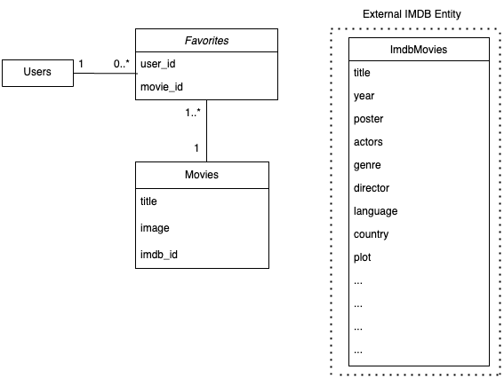
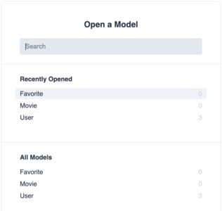
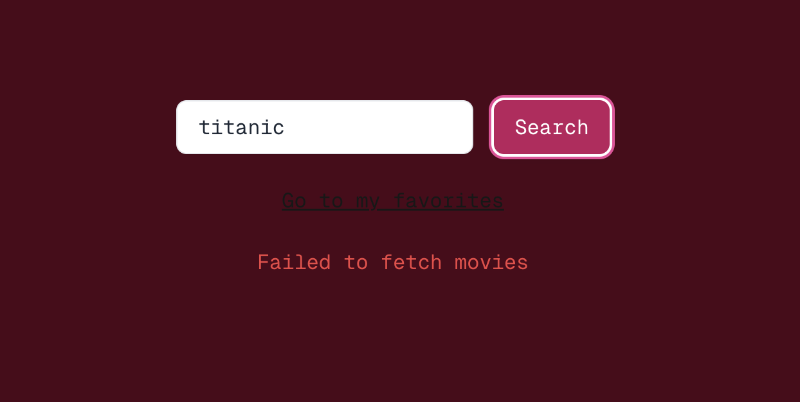

## 0 Getting started

- Information about how to read the readme, tools using

### 0.1 **How to read this README**

---

To easily follow this Workshop and README file, the README is structured according to a few conventions.

- Code and file names are written like `CodeExample`.
- Larger code parts are written as below, with the name of the viable file is included at the top after two `//`

```
// File Name

Newly added code together with some older code to understand where the new code should be put in
```

- If there are previous written code in the same file as the new code, this is implied by

```
/* ... */ (Previous code written)
```

- When Next.js concepts or other important words are mentioned, they are written in bold, as **Next.js Concept**

- If there are some deeper explainations to either concepts or why, these are written as the citation shown below. These can be skipped depending on how much in detail you want to go.
  > Example explaination of a concept

---

### 0.2 Technologies used

The technologies that we will be using in this project is TypeScript for both backend and frontend, [React.js](https://react.dev/) for the frontend, and [Next.js](https://nextjs.org/docs) which is a React framework where you can create Server Side Rendered (SSR) application and Backend-For-Frontends (BFFs) smoothly. For styling in the frontend we will use a utility based css library [Tailwindcss](https://tailwindcss.com/)

### 0.3 Download the repo and start the application

If you haven't already, please download the repo from [Github](https://github.com/LovreB/tech-bootcamp-ws)

To start the application you need to run:

- `npm install` - installing everything that is needed
- `npm run dev` - starts the application

Open [http://localhost:3000](http://localhost:3000) with your browser to see the result.

### 0.4 Problems running the application?

Make sure you have a node version >=18.18.0

# Frontend Path

This is the path for you who wants to dig deeper into the frontend world! To get started:

Some tips to get maximal value out of the workshop:

- Styling is FUN to add, but fully optional and up to you! However, we recommend to not put too much time on the styling to begin with.
- `enhancements` sections are smaller detailes that should be skipped to begin with, but can return to if there is time at the end.

## 0. Getting stared Frontend path

1. Check out the `frontend` branch - this has already implemented all API endpoints, but lack the frontend components.
2. Rename the `.env.sample` file to `.env`, and fill in the values as follows:

- _OMDB_API_KEY_ - the api key you have retrieved from OMDB
- _DATABASE_URL_ - Set db url as postgresql://yourFirstname.yourLastname:password.38.7.50:5432/postgres, where password will be retrieved in the workshop.
- _NEXT_PUBLIC_USERNAME_ - set username as yourFirstname.yourLastname

Password will be retrieved in the workshop.

> The .env file is used to store environment variables that configure your application, such as API keys and database URLs. These variables are loaded at runtime and help keep sensitive information secure and separate from your codebase.

Our BFF is a REST API, with the available endpoints:

- GET `/api/movies?title={title}&userId={userId}`, where `title` is something to search movies on, and `userId` is your own name + first letter of last name. Returns list of type `Movie`.

- GET `/users/{userId}/favorites`, Returns list of type `Movie`, which is the users movies marked as favorite.

- POST `/users/{userId}/favorites/{movieId}`, the sent movie will be marked as favorite for user with id `userId`.

> A REST API, also known as a RESTful API, is a simple, uniform interface that is used to make data available through web URLs. REST APIs are the most common APIs used across the web today.

In `types/Movie.ts` we have the `Movie` type, which we will use througout the project - please have a look!

## 1. Present movie

First task for us is to show a single movie. To do this, we will create a React component.

> A [React Component](https://react.dev/learn/your-first-component#components-ui-building-blocks) is a UI building block, that can contain markup + logic and be reused in the application. The component can contain other components, _child components_, and will then consequently become a _parent component_. It is often (and in our case) written using [tsx](https://react.dev/learn/writing-markup-with-jsx#jsx-putting-markup-into-javascript) files, which lets you embed markup inside javascript.

In `app/components/MovieCard.tsx` we have the component to use, which takes a `title` and `img` as props. Let's dig in how it works!

```
type MovieCardProps = {
  title: string;
  img: string;
};
```

- This is the props you will be able to send to the component, defined by a name - `title` and `img`, and their corresponding type - both are of type `string`.

> A [prop](https://react.dev/learn/passing-props-to-a-component) is how a parent component can pass information to a child component.

```
export const MovieCard = ({ title, img }: MovieCardProps) => {
  /*  */
};
```

- This is the name of the React Component, and specifying that it takes props as type `MovieCardProps`.

```
  return <p>My movie card</p>;
```

- As return value, we have the markup for the component. Here you can specify all normal html tags that you know of, such as `div` and `h1`.

### 1.1 Create your own MovieCard

Time to be playful!

**Task**: Display the movie title and the img in the react component.

To invoke javascript into the markup, you need to contain the variable in curly brackets, as:

```
  return (
    <>
      {myVariable}
    </>
  );
```

As told earlier, we are using Tailwind CSS for our styling (CSS).

> [Tailwind CSS](https://tailwindcss.com/) is a utility based CSS framework, where you build up your stylings by adding multiple CSS classes to your markup, where each class only sets one thing, such as `m-8` sets a margin of `8px`.

When styling html tags in React, we are using `className` instead of `class`. Example:

```
  return (
    <div className="my-tailwind-class">
      {myVariable}
    </div>
  );
```

Let the creativity flow with the styling, but don't put too much time on it :)

### 1.2 (Enhancements)

**Task**: Extend the props and MovieCard to also show a description and other attributes available in the `Movie` type.

## 2. Search for movie

... but wouldn't it be more fun if it was YOUR favorite movies that were shown here? Next part will allow us to search, and find, your faviourite movies!

But first, let us understand the index page. In Next.js, the file `app/page.tsx` is what is shown when you enter the `localhost:3000`

```
{movies.map((movie) => (
  <MovieCard
    title={movie.title}
    backgroundImg={movie.img}
    key={movie.imdbId}
    isFavorite={movie.isFavorite}
  />
))}
```

- This part maps each example movie (of type `Movie`) to your own `MovieCard`.

### 2.1 Add UI components

To be able to search, we need an input field and a button. This correspond to the html elements `input` and `button`

**Task:** Add an input field + button to `page.tsx`. Style them as you wish.

> In Next.js, there is a concept called [Layouts](https://nextjs.org/docs/app/building-your-application/routing/layouts-and-templates), which allows us to keep layout and state if route changes - for performance, but also handy for UI cohesiveness. In the top layout file, `layout.tsx`, one can specify styling that is to be applied to all pages. In out `layout.tsx`, for example we have specified the purple background color, given by the tailwind class `bg-rose-950` - feel free to change it!

### 2.2 Search logic

So how do we act based on what the user searches for?

In React, when we want to share and maintain a value used between components close to each other, we can use the React built-in hook `useState`.

> A [React hook](https://react.dev/learn#using-hooks) is like a tool that lets you add special features (like state and side effects) to your React components.

The `useState` hook returns two variables - one that contains the value, and one that is a function that updates the state. It can be used like:

```
  const [myState, setMyState] = useState(0); // 0 is the initial value in the state
  setMyState(2) /7 this sets 2 as the new value

  return <div>{myState}</div> // Will display "2", and update once the state updates.
```

_note_: hooks needs to be called at the top of the React Component, like

```
export const MyComponent = () => {
  const [myState, setMyState] = useState();
  /* ... */
  return <></>;
}
```

**Task:** When the user writes in the input field, save the value in a state.

To perform an action in code when the user performs an action, we can use the `onClick` attribute to buttons. `onClick` takes in a function, that is performed when the button is clicked, like:

```
  /* ... */
  return <>
    <button
      type="button"
      onClick={() => console.log('you are awesome!!')}
      >
      Click me
    </button>
  </>;

```

**Task:** When the user clicks on the search button, call the method `fetchMovies` with the input value. This is where we in the next step will fetch the movies!

### 2.3 Use BFF

Time to get some real data in your application! If you remember from the intro, this Next.js project also contains a Backend-For-Frontend. All `route.ts` files corresponds to an endpoint, where the path is given by the folder structure. For example `app/api/myPath/route.ts` corresponds to the endpoint `/api/myPath`.

> More documentation about Next.js routes found [here](https://nextjs.org/docs/app/building-your-application/routing/defining-routes).

To fetch something from our frontend, we can use the method `fetch` which is available globally within all js applications, such as:

```
  const url = "yourUrl";

  const response = await fetch(url);
  return await response.json();

```

**Task:** Update the `fetchMovies` function so that it calls our api backend instead of logging to the console. Hint: The available endpoints and what data to send are defined in the section [Getting Started](#0-getting-stared-frontend-path).

**Task:** Use the return value you get from `fetchMovies` and update the `movies` variable in `page.tsx`. Hint: How do we set state?

### 2.4 (Enhancements)

Some enhancements to your page - but skip at first and go back to these if there is time available at the end :)

**a) Initial view**

- Instead of showing static movies from the start, show a text "search for your favourite movie".

**b) Loading state**

- To get some user feedback when search button has been pressed, add a new state that contains if the page is loading. If it is, show something in the UI for the user.

### 2.5 Celebration!

Congrats for completing the first two steps and connecting frontend to the backend! Well done!!

## 3. Add to favorites

Next step is to add the possibility to select favorite movies!

### 3.1 Favorite Icon

In the `Movie` type, we have one attribute `isFavorite`, that that defines if you have marked this movie as favorite - this is something we can use in our Movie Cards when displaying the movie.

> To use assets (images / icons etc) in Next.js, you need to add your picture to the `public` folder. once there, it will be available to use in `` components by defining `` tag.

**Task**: Add the prop `isFavorite` to your MovieCard.tsx component, and display in the card if the movie is your favorite or not.

To not only display, but also be able to change the favorite status, we need a mechanism for that! To make it easier for you, we have prepared a method `addToFavorites` which calls the api endpoint `/users/{userId}/favorites/{movieId}` that adds a movie to the favorites. Use that function, or implement your own.

**Task**: Add a button to your MovieCard, that on click, calls the method `addToFavorites` with the `imdbId`. Give the user some feedback that favorite has been added.

### 3.2 (Enhancements)

**a) Toggle favorite on change**

- We want to be able to remove movies we have set as favorites as well. Implement a new button which removes a movie as a favorite on click. To remove a movie, you can use the same endpoint as when adding, but with a `DELETE` request instead of `POST`.

**a) Update the state on favorite change**

- When you are adding or removing an item as a favorite, we want to visualise directly if the card is a favorite or not.

## 4. Show favorites

Lastly, we want to be able to show our own favouries on a new page!

### 4.1 Add new route

To create a new page with Next.js, we need to create another `page.tsx` file. You might remember that in Next.js, the file `app/page.tsx` is what is shown when you enter the `localhost:3000`. It is due to that the route depends on where in the folder structure is placed, so that a `page.tsx` placed under `app/foo/boo/page.tsx` would correspond to the page `localhost:3000/foo/boo` This is just like the API endpoint depends on where the `route.ts` is located.

**Task**: Create a new page `localhost:3000/favorites` that displays a title "My Favorites".

### 4.2 Fetch and show your favorites

But for it to be a favorites page, we need to add favorites, right?

**Task**: Fetch all your favorites, and show them in your MovieCards.

### 4.3 (Enhancements)

**a) Link to pages**

- For easy access to your favorites page, link to it from your home page. Hint: the [anchor HTML element](https://developer.mozilla.org/en-US/docs/Web/HTML/Element/a), `<a>` tag, is used for linking to other pages.

**b) Loading state**

- Add a loading symbol when the movies are loading

### 4.4 Celebration!

Now you have completed the "main" part of this workshop - congratulations! Either go back and do the enhancements, or challenge yourself with improving the [responsiveness](https://www.w3schools.com/html/html_responsive.asp) or [A11y](https://developer.mozilla.org/en-US/docs/Web/Accessibility) - two very important aspects for a frontend engineer!

## Learn More

Did you like the tools we used in the workshop?

To learn more about Next.js, take a look at the following resources:

- [Next.js Documentation](https://nextjs.org/docs) - learn about Next.js features and API.
- [Learn Next.js](https://nextjs.org/learn) - an interactive Next.js tutorial.

# Backend path
## 0 Getting started - prerequisites
### 0.1 Access to OMDB API
In order to send requests to the OMDB API, you need to fetch an API-key. Go to the [OMDB API website](https://www.omdbapi.com/apikey.aspx?__EVENTTARGET=freeAcct&__EVENTARGUMENT=&__LASTFOCUS=&__VIEWSTATE=%2FwEPDwUKLTIwNDY4MTIzNQ9kFgYCAQ9kFggCAQ8QDxYCHgdDaGVja2VkZ2RkZGQCAw8QDxYCHwBoZGRkZAIFDxYCHgdWaXNpYmxlZ2QCBw8WAh8BaGQCAg8WAh8BaGQCAw8WAh8BaGQYAQUeX19Db250cm9sc1JlcXVpcmVQb3N0QmFja0tleV9fFgMFC3BhdHJlb25BY2N0BQhmcmVlQWNjdAUIZnJlZUFjY3TuO0RQYnwPluQ%2Bi0YJHNTcgo%2BfiAFuPZl7i5U8dCGtzA%3D%3D&__VIEWSTATEGENERATOR=5E550F58&__EVENTVALIDATION=%2FwEdAAV39P5KqwNGJgd%2F4UbyWCx3mSzhXfnlWWVdWIamVouVTzfZJuQDpLVS6HZFWq5fYpioiDjxFjSdCQfbG0SWduXFd8BcWGH1ot0k0SO7CfuulNNHYC5f864PBfygTYVt5wnDXNKUzugcOMyH4eryeeGG&at=freeAcct&Email=)
and generate a FREE API key.

When you have received the API key via e-mail, you can try using it in your terminal by fetching the titanic movie.

```bash
curl "http://www.omdbapi.com/?t=titanic&apikey=<API-KEY>"
```
This should return a Movie object representing the movie Titanic.

### 0.2 Existing Database tables in Google Cloud SQL
We will all use the same database for this workshop running in Google Cloud. The database is set up in Google Cloud with existing tables.
The tables are:
```
TABLE users (
    id VARCHAR(50) PRIMARY KEY
);
TABLE movies (
    id UUID PRIMARY KEY DEFAULT uuid_generate_v4(),
    title VARCHAR(255) NOT NULL,
    img TEXT NOT NULL,
    imdb_id VARCHAR(50) NOT NULL UNIQUE
);
TABLE favorites (
    id UUID PRIMARY KEY DEFAULT uuid_generate_v4(),
    user_id VARCHAR(50) NOT NULL,
    movie_id UUID NOT NULL,
    FOREIGN KEY (user_id) REFERENCES users(id),
    FOREIGN KEY (movie_id) REFERENCES movies(id)
);
```
Where `Users` is a prepped table containing all of us. The id for each user is `<firstname>.<lastname>`. This is
the table that will be used when you log in with your name in the frontend.
`Movies` will contain all movies marked as favorites, and `Favorites` is a table that connects users with their favorite movies.

Below is a UML diagram of the tables.



### 0.3 Prisma
The framework we will use to interact with the database is called Prisma. Prisma is a modern database toolkit that makes
database access easy with type-safe queries. A representation of the database tables can be viewed in
[prisma/schema.prisma](prisma/schema.prisma), and the client we will use to interact with the database is
setup in [prisma/prismaClient.ts](prisma/prismaClient.ts).

### 0.4 Service Layer Pattern/Layered Architecture.
In this workshop, we will work according to the Service Layer Pattern, also known as Layered Architecture.
This pattern is a design pattern that separates the different parts of a service into different layers. The layers are:
- Presentation Layer: The layer that presents data to the user (the controller or api in this case).
- Business Logic Layer: The logic that processes the data (also referred to as te service layer).
- Data Access Layer: The layer that interacts with the database (also referred to as the repository layer).
  The pros of this design pattern are:
  Modularity: Encourages separation of concerns, making it easier to understand and maintain the codebase.
  Flexibility: Allows for the evolution of individual layers without affecting the entire system.
  Scalability: Permits scaling of specific layers to accommodate changing requirements.

# 1 Configurations
## 1.0 Configure your personal OMDB API key and the URL
Set the omdb url and your personal api key from 0.1 in the [.env](.env) file.
```markdown
OMDB_API_KEY=7c90e613 #Set your own API key <your_personal_api_key>
OMDB_BASE_URL=http://www.omdbapi.com/
```

## 1.1 Configure database connection
For the database connection to work, you will need to set your username and password in the [.env](.env) file.
Your username is your firstname and the first letter of your last name separated by a dot, e.g. `johanna.d`.
Your password will be given to you during the workshop.

```markdown
# DB CONNECTION
DATABASE_URL=postgresql://<your-firstname>.<first-letter-of-your-last-name>:<password>@34.38.7.50:5432/postgres
```
To test your database connection, you can run Prisma Studio with the command:
```bash
npx prisma studio
```
This will open a browser window visualizing the database tables where you can click around and see the current data.
You are able to add, delete, and update data in the tables, but please be careful not to delete any data that
someone else might have added since it can ruin the exercise for others.



## 1.2 Configure next environment vars
Also add the following environment variables to the [.env](.env) file.
```markdown
# NEXT
NEXT_PUBLIC_USERNAME=<firstname>.<first-letter-of-lastname>
NEXT_PUBLIC_APP_URL="http://localhost:3000"
```
# 2 Running the application
## 2.1 Starting the application
To run the application, you need to install the dependencies and start the server.
Run
```bash
npm install
```
and then start the server with
```bash
npm run dev
```
The server will start on `http://localhost:3000` and the frontend will be available on `http://localhost:3000`.

## 2.2 Calling an endpoint
There is already one endpoint setup for you in the backend for fetching a user by id. It looks like this:
```bash
GET api/users/{id}
```
Open a new terminal and try curling the endpoint with your own id:
```bash
curl -X GET http://localhost:3000/api/users/<your-firstname>.<first-letter-of-your-last-name>
```
This should return a user object with your name
```bash
{"user":{"id":<your-firstname>.<first-letter-of-your-last-name>}}
```
Now everything seems to work and we are ready to start coding! 🚀

# 3. Searching for movie titles
We want to be able to search for movie titles in the frontend and display the search results.
First, make sure your server is still running, and go to `http://localhost:3000` in your browser.
There you will see a search field where you can search for movies. Try searching for a movie title, and you will see
the message "Failed to fetch movies".



This is because we have not yet implemented the search functionality
in the backend.
Let's do it together!

## 3.1 What is a RESTful search endpoint
A RESTful search endpoint is designed to allow clients to search or filter resources based on query parameters,
typically using the `GET` HTTP method. Our resource in this case, is movies, and we want to search using partial
movie titles. The endpoint will look as follows:
```bash
GET /api/movies?title=<partial-title>
```
So that when we call for example
```bash
GET /api/movies?title=star
```
and the request would return movies whose titles contain the word "star" (e.g. "Star Wars", "A Star is Born",
"Star Trek").
In this example, the title that we send along to the endpoint is called a query parameter.

## 3.2 Create the API route
In next.js, we can create an API route by placing a file `route.ts` in the `app/api` directory. Since we also want
movies included in the path of our endpoint, we add our `route.ts` file in the
`app/api/movies` directory. This route class represents the Presentation Layer for movies.

## 3.3 Create the GET endpoint
Let's first create a GET-endpoint that extracts the title from the request URL and returns it
as a response. Add the following code to `app/api/movies/route.ts`:
```typescript
import {NextResponse} from "next/server";

export async function GET(request: Request): Promise<NextResponse> {
    const url = new URL(request.url);
    const partialTitle = url.searchParams.get('title');
    return NextResponse.json({ partialTitle });
}
```
note that the path of the `route.ts` file corresponds to the path of the HTTP endpoint - this is how next determines
the path of the endpoint. The `GET` function is the handler for the GET request to the endpoint. It extracts the
`title` query parameter from the request URL and returns it as a JSON object.

## 3.2 Verify the endpoint response
To verify that the endpoint works, we can `curl` it in the terminal. Make sure you still have your
server running, and call the endpoint using
```bash
curl -X GET http://localhost:3000/api/movies?title=star&userId=<your-firstname>.<first-letter-of-your-last-name>
```
this should return a list of movies with the word "star" in the title.

## 3.3 Browse the OMDB API
Since we will get the movies from the OMDB API, we need to search for movies in their API.
We can look at their API at [omdbapi.com](http://www.omdbapi.com/). Browse to see if you find something useful for us.
You may see that they already have a search endpoint that we can use. You may see that they have an
option to specify partial matches - specifying the `s` parameter in the query string will
search for several partial matches instead. We will use this endpoint in our backend.

## 3.4 Integrate with the OMDB API
Now when we know what endpoint and options we should call, we create a client in our backend that fetches
movie titles from the OMDB API.

### 3.4.1 Types
Since we are using TypeScript, we have the advantage of being able to type the response from the OMDB API.
This helps us catch errors early and makes the code easier to read. We have already
created a type `OmdbMovie` representing the movie object that we get from the OMDB API.
```typescript
export type OmdbMovie = {
    "Title": string;
    "Year": string;
    "imdbID": string;
    "Type": string;
    "Poster": string;
}
```
We also have a type `OmdbSearchResponse` in the same directory representing the response from the OMDB API.
```typescript
import {OmdbMovie} from "@/app/types/omdb/OmdbMovie";

export type OmdbSearchResponse = {
    Search: OmdbMovie[];      // Array of movies matching the search
    totalResults: string;     // Total number of results as a string
    Response: string;         // "True" if the request was successful, otherwise "False"
}
```
We have also already created a type `Movie` representing the movie object that will e sent to the frontend.
```typescript
export type Movie = {
    /* Feel free to add more - så kan de själva välja i FE hur mycket detaljer de vill visa upp */
    imdbId: string;
    title: string;
    img: string;
    userId: string;
    isFavorite: boolean;
};
```
This is what we call a DTO which stands for Data Transfer Object. It is a design pattern used to transfer
data between software application subsystems. The idea of this is to encapsulate all information needed
by the calling system, without the calling system having to make several calls. It also allows you to
only transfer the data that is required rather than the entire domain object. Last of all, we also have a class
`InternalMovie` in `api/movies` that will be our domain object, i.e. the representation of a movie
in our backend.
```typescript
export class InternalMovie {
  private _id: string;
  private _imdbId: string;
  private title: string;
  private img: string;

  constructor(id: string, imdbId: string, title: string, img: string) {
    this._id = id;
    this._imdbId = imdbId;
    this.title = title;
    this.img = img;
  }

  get id(): string | null {
    return this._id;
  }

  get imdbId(): string | null {
    return this._imdbId;
  }

  static fromOmdbMovie(omdbMovie: OmdbMovie): InternalMovie {
    return new InternalMovie(
            "",
            omdbMovie.imdbID,
            omdbMovie.Title,
            omdbMovie.Poster
    );
  }

  static fromEntity(movieEntity: MovieEntity): InternalMovie {
    return new InternalMovie(
            movieEntity.id,
            movieEntity.imdb_id,
            movieEntity.title,
            movieEntity.img
    );
  }

  public toDto(isFavorite: boolean): Movie {
    return {
      imdbId: this._imdbId,
      title: this.title,
      img: this.img,
      isFavorite: isFavorite
    }
  }
}

```
It has a static factory method `from`which takes an `OmdbMovie` object and returns an `InternalMovie` instance.
This keeps transformation logic encapsulated within the `Movie` class, meaning that if the `OmdbMovie`
structure changes, you only need to update this method. The `toDto` method returns a `Movie` object
customized for the frontend where extra parameters specific for the calling user will be included.

### 3.4.2 Add search method in the omdbClient
We have a separate class `OmdbClient` in `api/movies/omdbClient.ts` which will be responsible
for all communication with the OMDB API. This class already holds the `apiKey` that you generated
for yourself in the beginning, as well as the `baseUrl` for the OMDB API. In this class
we will add a `search`-method that fetches movies and returns a `OmdbSearchResponse` using axios.
Axios is a promise-based HTTP client.
```typescript
import axios from 'axios';
import {OmdbSearchResponse} from "@/app/types/omdb/OmdbSearchResponse";

class OmdbClient {
  private readonly apiKey: string;
  private readonly baseUrl: string;

  constructor() {
    const apiKey = process.env.OMDB_API_KEY || '';
    const baseUrl = process.env.OMDB_BASE_URL || '';
    if (!apiKey) {
      throw new Error('OMDb API key not provided. Set the OMDB_API_KEY environment variable in .env.');
    } else if (!baseUrl) {
      throw new Error('OMDb API URL not provided. Set the OMDB_API_URL environment variable in .env.');
    }
    this.apiKey = apiKey;
    this.baseUrl = baseUrl;
  }
  
  /* <--------------- Add this method ---------------> */
  async searchByTitle(title: string): Promise<OmdbSearchResponse> {
    try {
      const response = await axios.get(this.baseUrl, {
        params: {
          s: title,
          apikey: this.apiKey,
        },
      });
      if (response.data && response.data.Response === 'True') {
        return response.data;
      } else {
        return {} as OmdbSearchResponse;
      }
    } catch (error) {
      console.error('Error fetching movie by title from OMDb:', error);
      throw new Error('Failed to fetch movie from OMDb');
    }
  }
}

export const omdbClient = new OmdbClient();
```

### 3.4.3 Search by title in MovieService
We also have a service class `MovieService` in `api/movies/MovieService.ts` that will use the `omdbClient` to
fetch movies. This service class will represent the Business Logic Layer for movies. In the `MovieService` we add
a method `searchByTitle` which will search for movies by title and return a list of `MovieDto` objects.
```typescript
import {OmdbMovie} from "@/app/types/omdb/OmdbMovie";
import {Movie} from "@/app/api/movies/Movie";
import {omdbClient} from "@/app/api/movies/omdbClient";
import {MovieDto} from "@/app/types/MovieDto";
import {OmdbSearchResponse} from "@/app/types/omdb/OmdbSearchResponse";

class MovieService {
    async searchByTitle(title: string/*, userId: string*/): Promise<MovieDto[]> {
        const response: OmdbSearchResponse = await omdbClient.searchByTitle(title);
        const movies: OmdbMovie[] = response.Search;
        return movies.map(Movie.from).map(movie => movie.toDto(false));
    }
}

// Instantiate and export an instance of MovieService
export const movieService: MovieService = new MovieService();
```
The observant reader will notice that we have commented out the `userId` parameter in the `searchByTitle` method.
The reason why the userId is also sent along is that whilst searching in the frontend, the frontend
also wants to know if the movies it displays are favorites for the user. This is why we have the `isFavorite`
boolean value within the `Movie` DTO object. This is of course user-specific, so we need to send along the userId.

### 3.4.3 Search by title and userId in MovieService
Updating the method to also determine if the user has marked the movie as a favorite, we can call the
`favoriteService` responsible for the favorite business logic. This service has a method `isFavorite` that
determines if a user has marked the movie as a favorite. We will add this logic to the search method.
We loop through all the movies and check if the user has marked the movie as a favorite. We then generate
the DTOs based on the result from isFavorite.
```typescript
class MovieService {
  async searchByTitle(title: string, userId: string): Promise<Movie[]> {
    const response: OmdbSearchResponse = await omdbClient.searchByTitle(title);
    const omdbMovies: OmdbMovie[] = response.Search;
    if (!omdbMovies) {
      return [];
    }
    /* <--------------- Add this block ---------------> */
    const movieDtos: Movie[] = await Promise.all(omdbMovies.map(async (omdbMovie) => {
      const movie: InternalMovie = InternalMovie.fromOmdbMovie(omdbMovie);
      const isFavorite: boolean = await favoriteService.isFavorite(userId, movie.imdbId!);
      return movie.toDto(isFavorite);
    }));
    return movieDtos;
  }
}
```

### 3.4.4 Call the search method from the Presentation layer
Now we can try calling this method from the api movies route that we created
```typescript
import {NextRequest, NextResponse} from "next/server";
import {movieService} from "@/app/api/movies/movieService";

export async function GET(request: NextRequest): Promise<NextResponse> {
    const partialTitle = request.nextUrl.searchParams.get("title")
    if (!partialTitle) {
        return NextResponse.json({ error: "Missing title query parameter" }, { status: 400 });
    }
    const matchingMovies = await movieService.searchByTitle(partialTitle); // <--- HERE
    return NextResponse.json(matchingMovies); // <--- AND RETURNING HERE
}
```
### 3.4.4 Verify the endpoint response
Curl the endpoint in the terminal to see if it works
```bash
curl -X GET "http://localhost:3000/api/movies?title=star&userId=<firstname>.<first-letter-of-lastname>"
```
it should return a list of movies with the word "star" in the title. Where isFavorite is false for all movies
since you have not liked any movies yet.

### 3.4.5 Trying out the search in the frontend
Use your browser and go to `http://localhost:3000` and search for a movie title. You should now see a
visualization of movies with the word you searched for in the title. Well done!! 🎉

## 3.5 Saving favorite movies
We want our users to be able to like their favorite movies by clicking the heart icon on the movie
when searching in the frontend.

### 3.5.0 Trying to add favorites in the frontend.
Use your browser and go to `http://localhost:3000` and search for a movie title. Try liking the movie
by clicking the heart. Then click "Go to my favorites". You will see that the movie
you liked is not added to your favorites. Let's fix it!

### 3.5.1 RESTful POST endpoint for saving favorite movies
We will add a POST endpoint that will save a movie.
The endpoint will look like this:
```bash
POST /api/users/{id}/favorites/{imdbId}
```
where users is still a resource, and favorites is a sub-resource of users. I.e. a users favorites only belongs
to that specific user.

### 3.5.2 Add the POST method for the API route for favorites
In the file `app/api/users/[userId]/favorites/[imdbId]/route.ts`, we already have a DELETE endpoint setup
for deleting favorites, and now we want to be able to POST favorites as well. Add the following function
to the route:
```typescript
export async function POST(request: NextRequest, context: { params: { userId: string, imdbId: string} }): Promise<NextResponse> {
  const params = await context.params;
  if (!params.userId || !params.imdbId) {
    return NextResponse.json({ error: "Invalid request, missing userId or imdbId" }, { status: 400 });
  }
  const movieDto: Movie = await favoriteService.addFavorite(params.userId, params.imdbId);
  return NextResponse.json({ movieDto }, { status: 201 });
}
```

### 3.5.3 Add the addFavorite method in the favoriteService
In the `app/api/favorites/favoriteService.ts` file, we will add the method `addFavorite` that will add a favorite.
This method needs to do three things:
1. verify that the user exists
1. check if there already exists a movie with the `imdbId` in the database, otherwise create it.
1. save the favorite for the user in the database.

```typescript
export class FavoriteService {

    /* <---------------- Add this method ----------------> */ 
    async addFavorite(userId: string, imdbId: string, ): Promise<Movie> {
        const user: UserDto = await userService.getUser(userId);
        if (!user) {
            throw new Error(`User with ID ${userId} not found`);
        }
        const favoriteMovie: InternalMovie = await movieService.getOrCreateMovie(imdbId);
        const favoriteEntity: FavoriteEntity | null = await favoriteRepository.saveFavorite(userId, favoriteMovie.id!);
        if (!favoriteEntity) {
            throw new Error(`Could not add favorite movie with IMDB ID ${imdbId} for user ${userId}`);
        }
        return favoriteMovie.toDto(true);
    }

}

export const favoriteService: FavoriteService = new FavoriteService();
```

### 3.5.4 Add the saveFavorite method in the favoriteRepository
In the `app/api/favorites/favoriteRepository.ts` file, we will for the first time touch the data
access layer of our application. We will add the method `saveFavorite` that will save a favorite
in the favorites table. Since the `favoriteService` has already checked that the
movie exists and extracted the `movieId`, we can safely add the favorite to the database
using the prisma `create`. Under the hood, this method will also make sure that the user
and the movie exist in the database. Prisma does this by keeping track of the relations in
`schema.prisma`. If the user or the movies does not exist, the prisma will throw an error.

```typescript
class FavoriteRepository {
  /* <---------------- Add this method ----------------> */ 
  async saveFavorite(userId: string, movieId: string): Promise<FavoriteEntity | null> {
    try {
      return await prisma.favoriteEntity.create({
        data: {
          user_id: userId,
          movie_id: movieId
        }
      });
    } catch (error) {
      console.error("Error adding favorite:", error);
      throw error;
    }
  }
}
```
Now you can go to the frontend again and try searching for and liking a movie. Clicking "Go to my favorites"
and you should see the movie you liked in your favorites list. Hurray! 🎉

## What you have learnt
In this workshop, you have touched many of the techniques and patterns
that backend developers use in modern development today. The principles and techniques we have used are:
1. You have worked with DTOs and Domain objects to separate concerns of the frontend from the
   representation of the domain objects in the backend.
1. You have used a relational database, postgresql, setup in Google Cloud SQL and
   interacted with it using an ORM, Object-Relational Mapping, Prisma.
1. You have created a RESTful API with endpoints for searching and saving favorites.
1. You have used a Service Layer Pattern to separate the different parts of the backend
   service into layers (repository, service and controller) - making your code more modular and easy to maintain.
1. You have integrated with a third-party API (OMDB) to fetch data used in your application.

## Feedback
We are super-interested in any feedback you might have on this workshop.
Please reach out to us personally on anyone from Talent Search to provide
your feedback. Looking forward to hearing from you!

## Future work
If you want to continue working on this outside of this workshop,
we suggest you exchange the cloud database with a local database.
We suggest running a PostgreSQL database in a docker container locally
using docker desktop. You can find the docker image for PostgreSQL at
[hub.docker.com](https://hub.docker.com/_/postgres).
Then configure your .env file `DATABASE_URL` to point to your local database.

Another very important part we have not touched on in this workshop is testing.
We highly recommend you to write tests for your code. If you want to practice
testing skills, we recommend you to try adding unit- and integration tests
for your application - for example using Jest.

If this application was to be reached on the internet, we would also need to
deploy it. We want to challenge you to think through the entire deployment
flow of the application from development to having the service spinning in the cloud for
public access. What would this flow look like? What services would you use?
This is a great exercise to understand the entire flow of a modern web application.

Good luck with your future projects! 🚀
