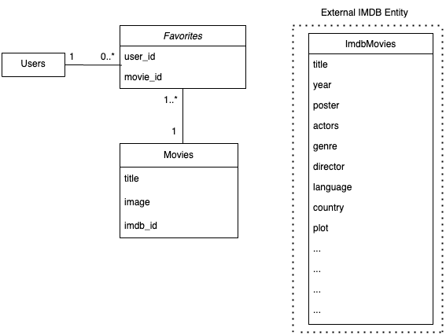
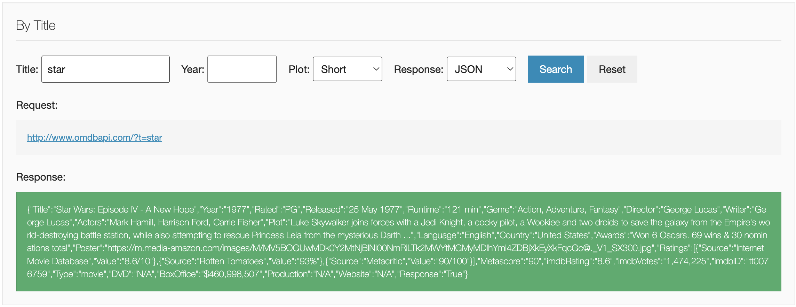

## 0 Getting started - prerequisites
### 0.1 Access to OMDB API
In order to send requests to the OMDB API, you need to fetch an API-key. Go to the [OMDB API website](https://www.omdbapi.com/apikey.aspx?__EVENTTARGET=freeAcct&__EVENTARGUMENT=&__LASTFOCUS=&__VIEWSTATE=%2FwEPDwUKLTIwNDY4MTIzNQ9kFgYCAQ9kFggCAQ8QDxYCHgdDaGVja2VkZ2RkZGQCAw8QDxYCHwBoZGRkZAIFDxYCHgdWaXNpYmxlZ2QCBw8WAh8BaGQCAg8WAh8BaGQCAw8WAh8BaGQYAQUeX19Db250cm9sc1JlcXVpcmVQb3N0QmFja0tleV9fFgMFC3BhdHJlb25BY2N0BQhmcmVlQWNjdAUIZnJlZUFjY3TuO0RQYnwPluQ%2Bi0YJHNTcgo%2BfiAFuPZl7i5U8dCGtzA%3D%3D&__VIEWSTATEGENERATOR=5E550F58&__EVENTVALIDATION=%2FwEdAAV39P5KqwNGJgd%2F4UbyWCx3mSzhXfnlWWVdWIamVouVTzfZJuQDpLVS6HZFWq5fYpioiDjxFjSdCQfbG0SWduXFd8BcWGH1ot0k0SO7CfuulNNHYC5f864PBfygTYVt5wnDXNKUzugcOMyH4eryeeGG&at=freeAcct&Email=) 
and generate a FREE API key.

When you have received the API key via e-mail, you can try using it in your terminal by fetching the titanic movie.

```bash
curl "http://www.omdbapi.com/?t=titanic&apikey=<API-KEY>"
```
This should return a Movie object representing the movie Titanic.

### 0.2 Existing Database tables in Google Cloud SQL 
We will all use the same database for this workshop running in Google Cloud. The database is set up in Google Cloud with existing tables. 
The tables are:
```
TABLE users (
    id VARCHAR(50) PRIMARY KEY
);
TABLE movies (
    id UUID PRIMARY KEY DEFAULT uuid_generate_v4(),
    title VARCHAR(255) NOT NULL,
    img TEXT NOT NULL,
    imdb_id VARCHAR(50) NOT NULL UNIQUE
);
TABLE favorites (
    id UUID PRIMARY KEY DEFAULT uuid_generate_v4(),
    user_id VARCHAR(50) NOT NULL,
    movie_id UUID NOT NULL,
    FOREIGN KEY (user_id) REFERENCES users(id),
    FOREIGN KEY (movie_id) REFERENCES movies(id)
);
```
Where `Users` is a prepped table containing all of us. The id for each user is `<firstname>.<lastname>`. This is
the table that will be used when you log in with your name in the frontend.
`Movies` will contain all movies marked as favorites, and `Favorites` is a table that connects users with their favorite movies.

Below is a UML diagram of the tables.



### 0.3 Prisma
The framework we will use to interact with the database is called Prisma. Prisma is a modern database toolkit that makes 
database access easy with type-safe queries. A representation of the database tables can be viewed in 
[prisma/schema.prisma](prisma/schema.prisma), and the client we will use to interact with the database is 
setup in [prisma/prismaClient.ts](prisma/prismaClient.ts).

### 0.4 Service Layer Pattern/Layered Architecture. 
In this workshop, we will work according to the Service Layer Pattern, also known as Layered Architecture. 
This pattern is a design pattern that separates the different parts of a service into different layers. The layers are:
- Presentation Layer: The layer that presents data to the user (the controller or api in this case). 
- Business Logic Layer: The logic that processes the data (also referred to as te service layer).
- Data Access Layer: The layer that interacts with the database (also referred to as the repository layer).
The pros of this design pattern are:
  Modularity: Encourages separation of concerns, making it easier to understand and maintain the codebase.
  Flexibility: Allows for the evolution of individual layers without affecting the entire system.
  Scalability: Permits scaling of specific layers to accommodate changing requirements.

# 1 Configurations
## 1.0 Configure your personal OMDB API key
Set the omdb url and your personal api key from 0.1 in the [.env](.env) file.
```markdown
OMDB_API_KEY=7c90e613 #Set your own API key <your_personal_api_key>
OMDB_BASE_URL=http://www.omdbapi.com/
```

## 1.1 Configure database connection
For the database connection to work, you will need to set your username and password in the [.env](.env) file.
Your username is your full name separated by a dot, e.g. `johanna.doe`. Your password will be given to you 
during the workshop.

```markdown
# DB CONNECTION
DATABASE_URL=postgresql://<firstname>.<lastname>:<password>@34.38.7.50:5432/postgres
```
To test your database connection, you can run Visma Studio with the command:
```bash
npx prisma studio
```
This will open a browser window visualizing the database tables where you can click around and see the current data.
You are able to add, delete, and update data in the tables, but please be careful not to delete any data that
someone else might have added since it can ruin the exercise for others.


# 2 Running the application
## 2.1 Starting the application
To run the application, you need to install the dependencies and start the server. 
Run
```bash
npm install
```
and then start the server with
```bash
npm run dev
```
The server will start on `http://localhost:3000` and the frontend will be available on `http://localhost:3000`.

## 2.2 Calling an endpoint
There is already one endpoint setup for you in the backend for fetching a user by id. It looks like this:
```bash
GET api/users/{id}
```
Open a new terminal and try curling the endpoint with your own id:
```bash
curl -X GET http://localhost:3000/api/users/<your-firstname>.<your-lastname>
```
This should return a user object with your name
```bash
{"user":{"id":<your-firstname>.<your-lastname>}}
```
Now everything seems to work and we are ready to start coding! 🚀

# 3. Searching for movie titles
We want to be able to search for movie titles in the frontend and display the search results.
## 3.1 What is a RESTful search endpoint
A RESTful search endpoint is designed to allow clients to search or filter resources based on query parameters, 
typically using the `GET` HTTP method. Our resource in this case, is movies, and we want to search using partial
movies titles. The endpoint will look as follows:
```bash
GET /api/movies?title=<partial-title>
```
So that when we call for example
```bash
GET /api/movies?title=star
```
and the request would return movies whose titles contain the word "star" (e.g. "Star Wars", "A Star is Born", 
"Star Trek").
In this example, the title that we send along to the endpoint is called a query parameter.

## 3.2 Create the API route
In next.js, we can create an API route by placing a file `route.ts` in the `app/api` directory. Since we also want
movies included in the path of our endpoint, we add our `route.ts` file in the
`app/api/movies` directory. This route class represents the Presentation Layer for movies.

## 3.3 Create the GET endpoint 
Let's first create a GET-endpoint that extracts the title from the request URL and returns it
as a response:
```typescript
import {NextResponse} from "next/server";

export async function GET(request: Request): Promise<NextResponse> {
    const url = new URL(request.url);
    const partialTitle = url.searchParams.get('title');
    return NextResponse.json({ partialTitle });
}
```
## 3.2 Verify the endpoint response
To verify that the endpoint works, we can `curl` it in the terminal. Make sure you still have your 
server running, and call the endpoint using
```bash
curl -X GET http://localhost:3000/api/movies?title=star
```
this should return a response
``` bash 
{"partialTitle":"star"}
```

## 3.3 Browse the OMDB API
Since we will get the movies from the OMDB API, we need to search for movies in their API. 
We can look at their API at [omdbapi.com](http://www.omdbapi.com/). Scroll down to "Examples" and 
browse to see if you find something useful for us. 
You may see that they already have a search endpoint that we can use. Typing in "star" in the title 
search field and clicking Search will give you a list of movies with the word "star" in the title.

Here we see what this endpoint looks like, and what response it sends. However, this endpoint is for exact
matches, and we want to search for partial matches. Specifying the `s` parameter in the query string will
search for several partial matches instead. We will use this. 

## 3.4 Integrate with the OMDB API
Now when we know what endpoint we should call, we create a client in our backend that fetches 
movie titles from the OMDB API. 

### 3.4.1 Adding types
Since we are using TypeScript, we have the advantage of being able to type the response from the OMDB API.
This helps us catch errors early and makes the code easier to read. We
can create a type `OmdbMovie` representing the movie object that we get from the OMDB API.
Create the file `OmdbApiMovie.ts` in the `omdb/types` directory.
```typescript
export type OmdbMovie = {
    "Title": string;
    "Year": string;
    "imdbID": string;
    "Type": string;
    "Poster": string;
}
```
Also create a type `OmdbSearchResponse` in the same directory representing the response from the OMDB API.
```typescript
import {OmdbMovie} from "@/app/types/omdb/OmdbMovie";

export type OmdbSearchResponse = {
    Search: OmdbMovie[];      // Array of movies matching the search
    totalResults: string;     // Total number of results as a string
    Response: string;         // "True" if the request was successful, otherwise "False"
}
```
Also create a type `MovieDto` in the types directory representing the movie object that will e sent to the frontend.
```typescript
export type MovieDto = {
    /* Feel free to add more - så kan de själva välja i FE hur mycket detaljer de vill visa upp */
    imdbId: string;
    title: string;
    img: string;
    userId: string;
    isFavorite?: boolean;
};
```
DTO stands for Data Transfer Object, and is a design pattern used to transfer data between software application subsystems.
Last of all, we create a class `Movie` in `api/movies` that will be used to represent the movie object in the backend.
```typescript
import {OmdbMovie} from "@/app/types/omdb/OmdbMovie";
import {MovieDto} from "@/app/types/MovieDto";

export class Movie {
    private imdbId: string;
    private title: string;
    private img: string;

    constructor(imdbId: string, title: string, img: string) {
        this.imdbId = imdbId;
        this.title = title;
        this.img = img;
    }

    static from(omdbMovie: OmdbMovie): Movie {
        return new Movie(
            omdbMovie.imdbID,
            omdbMovie.Title,
            omdbMovie.Poster
        );
    }

    public toDto(): MovieDto {
        return {
            imdbId: this.imdbId,
            title: this.title,
            img: this.img,
            isFavorite: false,
            userId: ""
        }
    }
}
```
It has a static factory method `from`which takes an `OmdbMovie` object and returns a `Movie` instance. 
This keeps transformation logic encapsulated within the `Movie` class, meaning that if the `OmdbMovie`
structure changes, you only need to update this method. The `toDto` method returns a `MovieDto` object
customized for the frontend where extra parameters specific for the calling user will be included. 

### 3.4.2 Create the omdbClient file
Create a separate class `OmdbClient` in `api/movies/omdbClient.ts`. Add a search method that fetches movies
and return a `OmdbSearchResponse`.
```typescript
import axios from 'axios';
import {OmdbSearchResponse} from "@/app/types/omdb/OmdbSearchResponse";

class OmdbClient {
    private readonly apiKey: string;
    private readonly baseUrl: string;

    constructor() {
        const apiKey = process.env.OMDB_API_KEY || '';
        const baseUrl = process.env.OMDB_BASE_URL || '';
        if (!apiKey) {
            throw new Error('OMDb API key not provided. Set the OMDB_API_KEY environment variable in .env.');
        } else if (!baseUrl) {
            throw new Error('OMDb API URL not provided. Set the OMDB_API_URL environment variable in .env.');
        }
        this.apiKey = apiKey;
        this.baseUrl = baseUrl;
    }
    
    async searchByTitle(title: string): Promise<OmdbSearchResponse> {
        try {
            const response = await axios.get(this.baseUrl, {
                params: {
                    s: title,
                    apikey: this.apiKey,
                },
            });
            if (response.data && response.data.Response === 'True') {
                return response.data;
            } else {
                return {} as OmdbSearchResponse;
            }
        } catch (error) {
            console.error('Error fetching movie by title from OMDb:', error);
            throw new Error('Failed to fetch movie from OMDb');
        }
    }
}

export const omdbClient = new OmdbClient();
```
This holds the `apiKey` that you generated for yourself in the beginning, as well as the `baseUrl` for 
the OMDB API.

### 3.4.3 Create a Movie Service
Create a service class `MovieService` in `api/movies/MovieService.ts` that will use the `omdbClient` to fetch movies.
This service class will represent the Business Logic Layer for movies. In the `MovieService` we add 
a method `searchByTitle` which will search for movies by title and return a list of `MovieDto` objects.
```typescript
import {OmdbMovie} from "@/app/types/omdb/OmdbMovie";
import {Movie} from "@/app/api/movies/Movie";
import {omdbClient} from "@/app/api/movies/omdbClient";
import {MovieDto} from "@/app/types/MovieDto";
import {OmdbSearchResponse} from "@/app/types/omdb/OmdbSearchResponse";

class MovieService {
    async searchByTitle(title: string/*, userId: string*/): Promise<MovieDto[]> {
        const response: OmdbSearchResponse = await omdbClient.searchByTitle(title);
        const movies: OmdbMovie[] = response.Search;
        return movies.map(Movie.from).map(movie => movie.toDto());
    }
}

// Instantiate and export an instance of MovieService
export const movieService: MovieService = new MovieService();
```

### 3.4.4 Call the search method from the Presentation layer
Now we can try calling this method from the api movies route that we created
```typescript
import {NextRequest, NextResponse} from "next/server";
import {movieService} from "@/app/api/movies/movieService";

export async function GET(request: NextRequest): Promise<NextResponse> {
    const partialTitle = request.nextUrl.searchParams.get("title")
    if (!partialTitle) {
        return NextResponse.json({ error: "Missing title query parameter" }, { status: 400 });
    }
    const matchingMovies = await movieService.searchByTitle(partialTitle); // <--- HERE
    return NextResponse.json(matchingMovies); // <--- AND RETURNING HERE
}
```
### 3.4.4 Verify the endpoint response
Curl the endpoint in the terminal to see if it works
```bash
curl -X GET http://localhost:3000/api/movies?title=star
```
it should return a list of movies with the word "star" in the title.
For now, userId will be empty, and isFavorite will be false for all entries. We will add these later.

## 3.5 Saving favorite movies
### 3.5.1 RESTful POST endpoint for saving favorite movies
We want our users to be able to like their favorite movies. We will add a POST endpoint that will save a movie. 
The endpoint will look like this:
```bash
POST /api/users/{id}/favorites/{imdbId}
```
where users is still a resource, and favorites is a sub-resource of users. I.e. a users favorites only belongs
to that specific user.

### 3.5.2 Create the API route for favorites
Add the file `app/api/users/[userId]/favorites/[imdbId]/route.ts` with the following content:
```typescript
export async function POST(request: NextRequest, context: { params: { userId: string, imdbId: string} }): Promise<NextResponse> {
  const params = await context.params;
  if (!params.userId || !params.imdbId) {
    return NextResponse.json({ error: "Invalid request, missing userId or imdbId" }, { status: 400 });
  }
  return NextResponse.json({ }, { });
}
``` 


